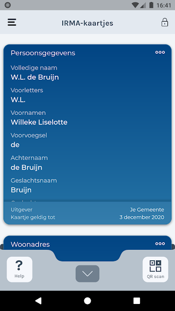
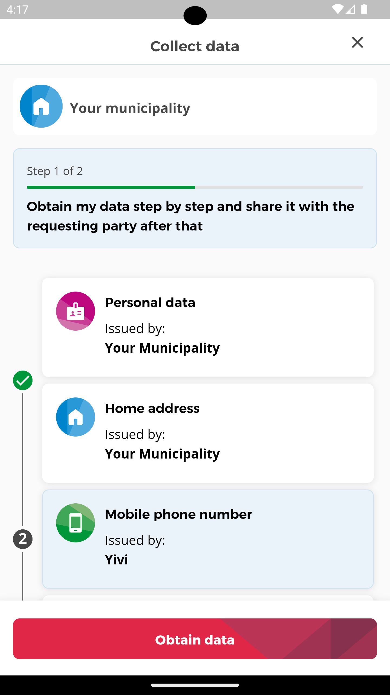
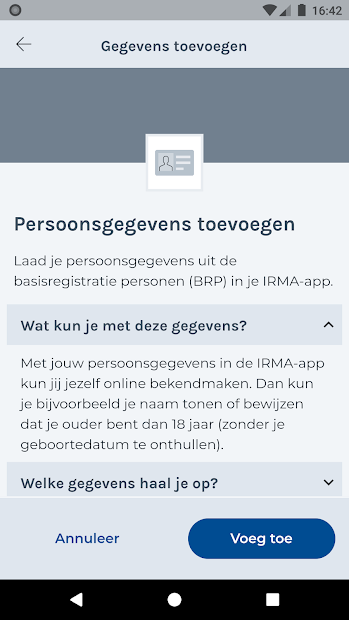

# irmamobile

## Authentication made easy, privacy-friendly, and secure

Yivi, formerly known as IRMA, offers a privacy-friendly, flexible and secure solution to many authentication problems,
putting the user in full control over his/her data.

The Yivi app manages the user's cards containing personal data. It can receive new cards, selectively disclose data contained in the user's cards to others, and
attaching data to signed statements. These data can be relevant properties, such as: "I am over 18", "my name is
..." and "I am entitled to access ....". They are only stored on the user's device and nowhere else.

> **_NOTE:_** During the transition period in which we change IRMA to Yivi, it can happen that both names are used interchangeably.

[](https://play.google.com/store/apps/details?id=org.irmacard.cardemu)
[](https://itunes.apple.com/nl/app/irma-authentication/id1294092994)
[](https://f-droid.org/packages/org.irmacard.cardemu/)

&nbsp;
&nbsp;
&nbsp;
&nbsp;

## Development setup

* Clone the project

      git clone --recursive git@github.com:privacybydesign/irmamobile.git

* If your forgot to include `--recursive` in your `git clone`, make sure to init and update the submodules:

      cd irmamobile
      git submodule init
      git submodule update

* Install Java development kit. We recommend to use Java 17.

      # On Debian / Ubuntu
      apt install openjdk-17-jdk

      # On MacOS
      # TODO: Install via `brew install openjdk@17`, but how to replace system Java?

* Install the Android SDK tools by going to the [Android developer download page](https://developer.android.com/studio/).
  Make sure to install the build-tools and platform for Android >= 28. In addition
  to the SDK platform, the following SDK tools need to be installed:
  * Android SDK Command-line Tools
  * Android SDK Build-Tools
  * Android SDK Platform-Tools
  * NDK
  * CMake

  If you're using the SDK Manager of Android Studio: you can find specific versions for Build-Tools
  by enabling the option `Show Package Details`.

* Update your environment. You installed the Android SDK in the previous step, but
  you will still need to update your `PATH` to make sure you can access the utilities provided and to
  make sure that flutter keeps working, you will need to export an `ANDROID_HOME` environment
  variable:

      echo 'export ANDROID_HOME="/YOUR/PATH/TO/android-sdk"' >> "$HOME/.bashrc"
      echo 'export PATH="$ANDROID_HOME/tools:$ANDROID_HOME/platform-tools:$PATH"' >> "$HOME/.bashrc"

* Download Flutter from the [download page](https://flutter.dev/docs/get-started/install) and
  follow their installation steps. Make sure to update your $PATH again.

* Run `flutter doctor` to see what steps remain to get a fully operational development environment
  for flutter (this may include accepting the android licenses). At this point you could also
  download your development environment.

* Install Go from the [Go download page](https://golang.org/dl/) or by using your OS package
  manager.

* Run `go install golang.org/x/mobile/cmd/gomobile` to install gomobile.

* Run `gomobile init` to initialize gomobile.

* Create the irmagobridge: `./bind_go.sh`.

* Start an emulator or connect a device via USB and run the flutter project: `flutter run` (iOS) or
  `flutter run --flavor alpha` (Android). You can also use Android Studio or Visual Studio Code for this step.
  The alpha flavor on Android does not open universal links. If you need to test these, you need to build
  the beta flavor (`flutter run --flavor beta`). In order to install a beta flavor build, you need to uninstall
  the Play Store version of the Yivi app. Therefore, it is practical to only do this in a simulator or a dedicated
  test device. In case you run the flutter project via Android Studio, you can specify the build flavor in the
  run configuration. On iOS, no custom flavor should be specified.

* You can use `flutter run -t` to run different app configurations, for example run `flutter run -t lib/main_prototypes.dart` to start the app in the prototypes menu.

## JSON serialization code

This project uses json_serializer. To re-generate serialization code, run `./codegen.sh`

## Integration tests
_The integration tests are in development, so not all use cases are covered yet._

As preliminary to run the integration tests, you need a fully configured [irmamobile development setup](#development-setup).

### Run locally using an iOS/Android simulator
The full set of integration tests can be started in the following way:

      # For an iOS testing device/simulator
      flutter test integration_test/test_all.dart
      # For an Android testing device/simulator
      flutter test integration_test/test_all.dart --flavor=alpha

You can also run the integration tests in a specific test file only. For example:

      flutter test integration_test/issuance_test.dart

Note: `flutter test` also supports directory paths as argument. When doing this, all tests in that particular directory are run.
However, a new build is made for every test file. Running multiple tests in this way takes much more time for that reason.

### Run on Android natively

To natively run the integration tests on Android, you can use the command below.

      flutter pub get
      (cd android && ./gradlew app:connectedAlphaDebugAndroidTest -Ptarget=`pwd`/../integration_test/test_all.dart)

You can also manually build APKs for testing using Fastlane.

      bundle exec fastlane android_build_integration_test

The APKs can be found in `./fastlane/build`. They can be uploaded to services like [Google Firebase](https://flutter.dev/docs/testing/integration-tests#uploading-an-android-apk).
You can also run them locally using the following commands:

      adb install ./fastlane/build/app-alpha-debug.apk
      adb install ./fastlane/build/app-alpha-debug-androidTest.apk
      adb shell am instrument -w -r foundation.privacybydesign.irmamobile.alpha.test/androidx.test.runner.AndroidJUnitRunner

### Run on iOS natively

To natively run the integration tests as XCTests on iOS, you can do this using XCode.

At first, you need to choose which test you want to run. For example, to run the tests in `issuance_test.dart` you execute:

      flutter build ios integration_test/issuance_test.dart --config-only

The tests can be started by opening the `ios/Runner.xcworkspace` in XCode and then start the tests via Product > Test.

You can use testing services like [Google Firebase](https://docs.flutter.dev/testing/integration-tests#uploading-xcode-tests) to easily run your tests on physical devices.
The testing service of your choice needs to support XCTest (not to be confused with XCUITest).
You can make a build for this purpose using Fastlane:

      bundle exec fastlane ios_build_integration_test

The integration test build should be provisioned with at least a development provisioning profile. More information
about how to set the provisioning profile can be found in the [Fastlane documentation](/fastlane/README.md#ios_build_integration_test).

The generated `./fastlane/build/ios_tests.zip` can be uploaded to Google Firebase.

## Fastlane
For build automation we use Fastlane scripting. These scripts are used by our CI tooling (i.e. the GitHub Actions
workflows in .github/workflows). Documentation about the Fastlane scripting can be found [here](/fastlane/README.md).

## Troubleshooting

* Have you checked out the two submodules of this repository? If `find ./irma_configuration` is empty, this is the case.
* If something has changed in the `irmagobridge` or in `irmago` then rerunning `./bind_go.sh` is required.
* In case you get the warning that the `ndk-bundle` cannot be found, please set the `ANDROID_NDK_HOME`
  environment variable to the right ndk version directory. These version directories can be found in `$ANDROID_HOME/ndk`.
  For example, you have to specify `export ANDROID_NDK_HOME=$ANDROID_HOME/ndk/<NDK_VERSION>`.
  You can also make a symlink in `ANDROID_HOME` by doing
  `ln -s $ANDROID_HOME/ndk/<NDK_VERSION> $ANDROID_HOME/ndk-bundle`. In here `<NDK_VERSION>` should be replaced
  with the NDK version you want to use.
* When you get an error related to `x_cgo_inittls` while running `./bind_go.sh`, you probably use an incorrect version of the Android NDK or your Go version is too old.
* When the flutter tool cannot find the generated apk after building for Android, the flavor is probably omitted. You need to run `flutter run --flavor alpha` or `flutter run --flavor beta`.
* When you are working with Windows, you need to manually make a symlink between the configuration folders. You can do this by opening a terminal as administrator and use the following command: `mklink /d .\android\app\src\main\assets\irma_configuration .\irma_configuration`.
* When you are building for iOS using XCode and you get `Dart Error: Can't load Kernel binary: Invalid kernel binary format version.`, then likely your Flutter cache is corrupted. You can empty and reload the Flutter cache in the following way:
```shell
pushd $(which flutter)/../
rm -rf ./cache
flutter doctor
flutter precache --ios
popd
flutter pub get
cd ./ios && pod install
```
